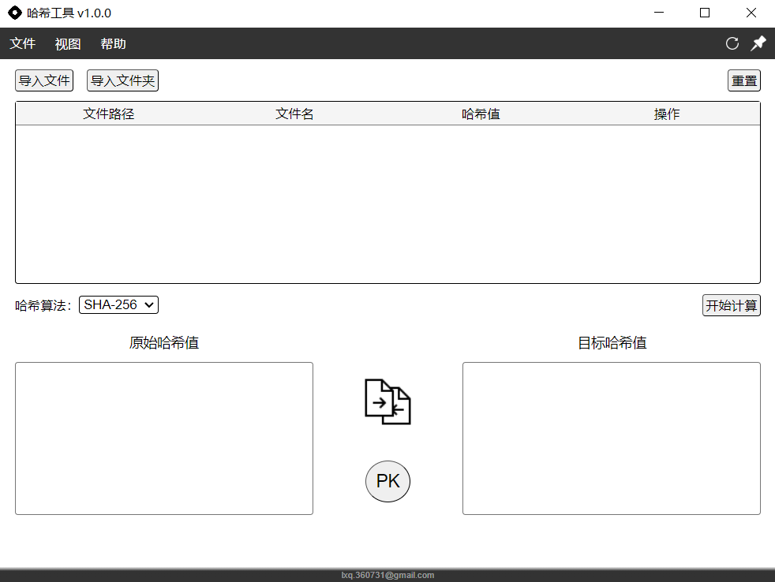

 ## 主界面

### 导入功能

1. 导入文件：导入指定文件到文件列表
   - 菜单栏：文件 -> 导入文件
   - 内容区域：**导入文件**按钮
2. 导入文件夹：导入文件夹内所有文件到文件列表
   - 菜单栏：文件 -> 导入文件夹
   - 内容区域：**导入文件夹**按钮

### 文件列表

1. 文件行：列举文件的文件路径、文件名、哈希值和操作按钮（`导入文件后才能显示`）
   - **检验**按钮：将文件的哈希值输出到**原始哈希值**区域
   - **复制**按钮：将文件的哈希值复制到**剪贴板**
   - **详情**按钮：查看文件哈希值详情（`包括文件路径、文件名、哈希算法、哈希值`）
   - **导出**按钮：导出选中文件的哈希值详情（`包括文件路径、文件名、哈希算法、哈希值`）

2. 重置：清空文件列表中导入文件

### 哈希值

1. 哈希算法：选择计算哈希值的算法（`默认为sha256`）
   - 内容区域：**哈希算法**选框
2. 哈希计算：使用选择的哈希算法计算文件列表所有文件对应的哈希值
   - 内容区域：**开始计算**按钮

3. 哈希值比较：对**原始哈希值**和**目标哈希值**中的字符串进行比较（`忽略字符串两端的空格`）
   - 内容区域：**PK**按钮

### 导出功能

1. 单个文件导出：导出选中文件的哈希值详情（`包括文件路径、文件名、哈希算法、哈希值`）
   - 内容区域：文件列表 中文件行的 **导出**按钮

2. 全部文件导出：导出所有文件的哈希值详情（`包括文件路径、文件名、哈希算法、哈希值`）
   - 菜单栏：文件 -> 导出为...
   - 内容区域：**导出全部**按钮（`导入文件后才能显示该按钮`）

## 源代码

### 安装依赖

1. 运行环境：Node.js（`内置npm包管理系统`）
2. 依赖：项目所需的外部模块

~~~javascript
npm install
// 根据package.json文件安装所需依赖
// electron：开源框架，构建跨平台的桌面应用程序
// electron-reloader：热加载模块
// electron-builder：打包模块
~~~

### 执行命令

~~~javascript
npm start
// npm run start
// 启动应用程序

npm run build
// 打包应用程序
~~~